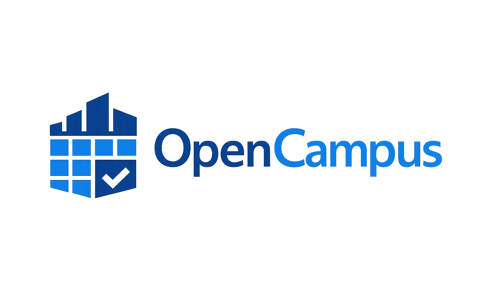
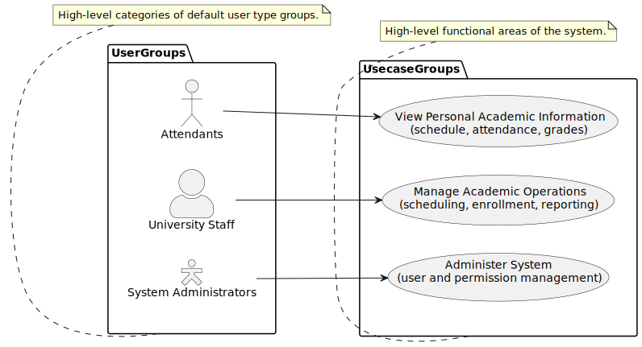
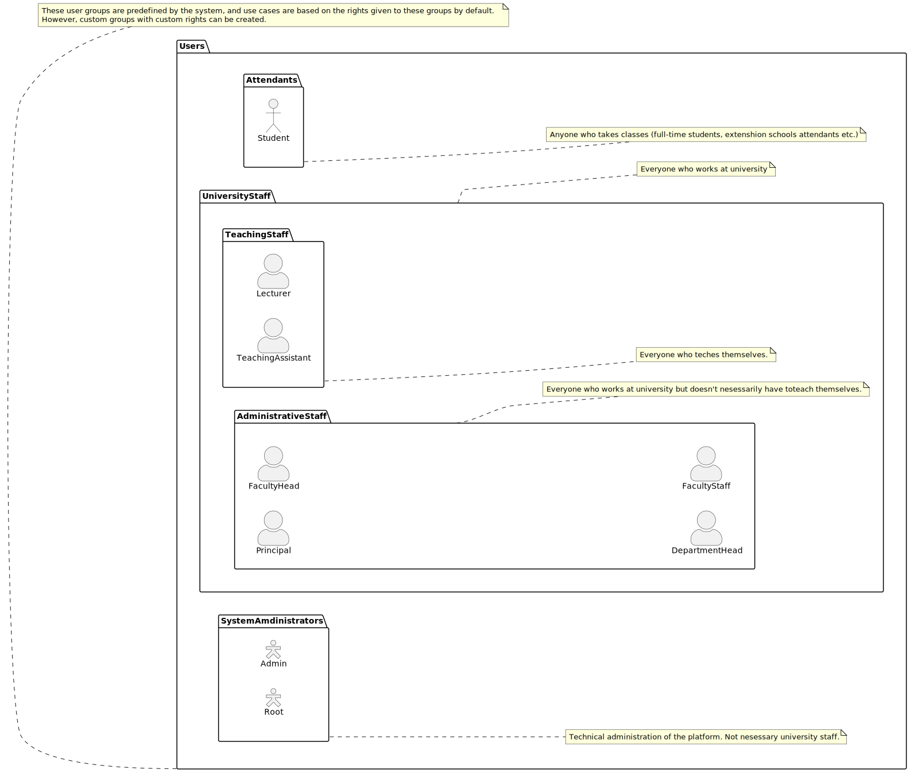
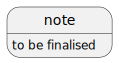

# OpenCampus
OpenCampus is an open-source, self-hosted platform for managing university scheduling, academic structure, and student attendance.

The system is designed as a modular monolith built with Go and PostgreSQL, prioritising reliability, clear architecture, and straightforward deployment in institutional environments.

## Documentation

See `docs/README.md` for the full documentation index.

## Overview
**You can read README [as a webpage](https://technodamo.github.io/OpenCampus/) (recommended).**

[Project Wiki](https://github.com/TechnoDamo/OpenCampus/wiki)

Universities often rely on fragmented or legacy systems for timetable management and attendance tracking. OpenCampus provides a modern, extensible alternative that institutions can host on their own infrastructure.

The platform aims to:

* Centralise academic scheduling
* Track and report attendance
* Manage course structure and enrollment
* Provide role-based access control
* Remain lightweight and easy to deploy

## Key Features

* Course and timetable management
* Student enrollment tracking
* Attendance recording and reporting
* Role-based access control (RBAC-ready)
* Administrative reporting
* Self-hosted deployment

Planned:

* LDAP / SSO integration
* Multi-tenant support
* Automated scheduling conflict detection

### General context

### User groups

### Use cases


## System Components

* **Core API** — Go-based backend service implementing business logic
* **Database** — PostgreSQL primary data store
* **Web Interface** — Browser-based UI (in development)
* **Deployment** — Containerised using Docker

## Architecture



Additional design diagrams are available in:

```
docs/diagrams/
```

Including:

* System context
* Actor hierarchy
* Scheduling use cases
* Attendance use cases
* Administration use cases
* Domain model

## Repository Structure

```
services/
  api/
    cmd/                Application entrypoints
    internal/           Business logic and modules

db/
  migrations/           Database schema evolution
  schema/               Base schema definitions
  seed/                 Development seed data

web/                    Frontend application (planned)

docs/
  uml/                  PlantUML source files
  diagrams/             Rendered diagrams

deploy/
  docker-compose.yml    Local deployment configuration
```

## Technology Stack

* **Backend:** Go (Golang)
* **Database:** PostgreSQL
* **Frontend:** Planned (React)
* **Containerisation:** Docker

## Development Requirements

* Go (latest stable version recommended)
* Docker and Docker Compose
* PostgreSQL (if running without containers)

## Getting Started (Planned)

Initial setup instructions will be provided with the first MVP release.

Planned workflow:

```bash
git clone <repository>
cd opencampus
docker compose up
```

## Database

PostgreSQL is used as the primary relational data store.

Schema management will be handled through versioned migrations located in:

```
db/migrations/
```

## Roadmap

Near Term:

* Core scheduling functionality
* Attendance recording workflow
* Basic administrative interface

Mid Term:

* Reporting dashboard
* RBAC configuration UI
* API stability

Long Term:

* Multi-tenant support
* External integrations
* High-availability deployment


## Documentation

Architecture and system design documentation:

```
docs/
```

Includes UML diagrams and domain modelling artifacts.

## Contributing

Contributions, bug reports, and feature proposals are welcome.

Contribution guidelines and development workflow will be documented as the project reaches MVP maturity.

## Security

Security issues should be reported privately to the maintainers.

A formal security policy will be added prior to production deployments.

## License

License will be specified before the first stable release.
